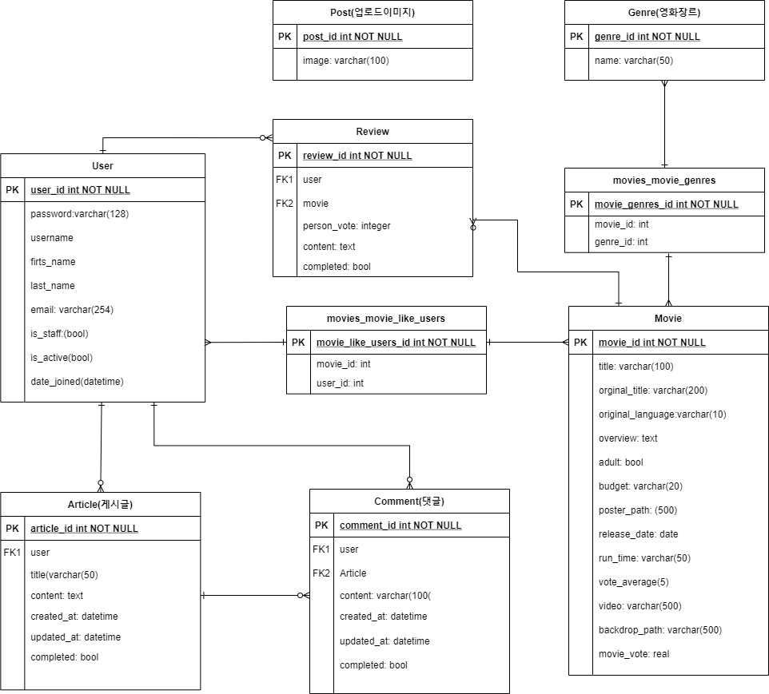

# FinalProject

# 나닮배 (나를 닮은 배우)

### 🚩아키텍쳐

**Django Rest API 서버 & Vue.js**

### ※ 개발도구

### :earth_asia: 데이터베이스 모델링(ERD)

### :arrow_forward: 데이터 수집

1. 영화 데이터: The Movie Database(TMDB)
2. 나를 닯은 배우(나닯배): [네이버 clova api]([https://developers.naver.com/docs/clova/api/CFR/API_Guide.md](https://developers.naver.com/docs/clova/api/CFR/API_Guide.md))

### :man_artist: 팀원 정보 및 업무 분담 내역

팀장 : 민평홍

Main : 백엔드

- Database Modeling(ERD) 설계, DB관리
- Vue 요청에 대한 응답 설계
- 영화 데이터, 배우 데이터 API 요청을 통한 데이터 수집
- 네이버 clova API를 통한 닮은 배우 기능 구축
- PPT 제작

조원 : 서강준

Main : 프론트엔드

- Router 및 Vue component 설계
- css, javascript, bootstrap(jquery)를 통한 화면 디자인
- Django(back)에 데이터 요청 함수 설계
- 다양한 버튼, 효과 기능 구현(pagination, carousel, 등)
- 영상 제작

### :goal_net: 목표 서비스 구현 및 실제 구현 정도

**서비스 목표**

- 사이트 사용자들에게 영화 정보 제공 및 영화 추천 서비스
    - TMDB 데이터 이용
- 유저의 영화 리뷰 공유
- 유저간 커뮤니티를 통한 의견 공유

**실제 구현**

**영화 정보 제공**

- 영화 줄거리, 평점, 예고편.. 등을 제공
- 영화 장르별 필터링

**영화 추천**

1. 나를 닮은 배우
    - 업로드된 이미지 파일을 기반으로 나와 닮은 유명인 탐색
    - 네이버 이미지 검색을 통한 닮은 유명이 사진 제공
    - 나와 닮은 유명인이 나온 영화 리스트 제공(구글 검색 링크 제공)
2. 랜덤 영화 추천
3. 내가 찜한 영화 리스트
4. 상위 평점 5개 영화 추천

**리뷰**

- 영화 한줄평과 별점 남기기 구현

**커뮤니티**

- 게시글 작성과 댓글

### :key: 필수 기능에 대한 설명

### HOME

1. 나닮배(나를 닮은 배우) 기능

    

    - 목적 : 등록한 사진과 닮은 배우를 찾아주고 그 배우가 나온 영화를 알려주는 페이지(Similar)로 이동!

2. 랜덤 영화 추천 기능

    

    - 목적 : 무엇을 볼 지 모르는 사람들에게 무작위로 영화 추천!
    - 포스터로 마우스를 가져가면, 영화 정보 제공!
    - 구현 방법
        1. axios를 통해 모든 영화 중 무작위로 하나를 선택 제공
        2. javascript를 활용하여 hover를 통한 class styling
3. 내가 찜한 영화 보기

    

    - 목적 : 로그인한 유저가 이미 '좋아요'한 영화 정보를 표현해준다.
    - 포스터로 마우스 이동시 영화 정보 제공, 클릭 시 detail로 이동
    - 구현 방법
        1. bootstrap carousel styling을 통해 좋아요한 데이터를 표현해준다.

4. 최고 평점 영화 Top 5

    

    - 목적 : 영화 데이터 중 가장 높은 평점을 받은 영화 순으로 정보를 제공한다.
    - 클릭을 통해 대략적인 정보가 나타난다(bootstrap offcanvas 이용)

    

### Profile

※ 작성한 게시글, 리뷰, 댓글를 한곳에 볼 수 있다.

Profile 구성 요소 : detail를 통해 작성된 장소로 이동!

1. 내가 작성한 게시물
2. 내가 작성한 리뷰
3. 내가 작성한 댓글

### ⭐Similar(나닮배-나를 닮은 배우)

- 목적 : 사진 등록 시, 닮은 배우를 찾아주고 그 배우가 나온 영화를 소개해준다.
- 작동 순서
    1. 사진 등록하러 가기 버튼 클릭!
    2. 이미지 파일 선택 후, 제출!

        

    3. 내 사진과 닮은 배우를 찾고 일치율도 제공한다.

    

    4. 하단에 그 배우가 나온 영화를 제공한다.

    

    - 구현 방법
        1. 네이버 clova api를 통한 얼굴 인식을 통한 닮은 배우와 일치율 정보를 응답받는다.
        2. 받은 배우 이름을 네이버 이미지 검색 api를 통해 배우의 사진을 가져와 제공한다.

### Movie

1. 영화 검색 기능

moultiselect 라이브러리 이용

[vue-multiselect_github]([https://github.com/shentao/vue-multiselect](https://github.com/shentao/vue-multiselect))

제목에 검색어가 포함된 모든 영화 목록 출력

2. 영화 장르별 필터 기능

- 버튼 클릭시 해당 장르에 해당하는 영화 목록들만 출력
- 해당 장르에 해당하는 genreId 숫자를 함수의 인자로 넘겨주었다
- btn-group과 toggle 기능, radio input type을 이용해서 버튼 스타일링

3. 영화 선택

- 포스터로 마우스 이동시 영화 정보 제공, 클릭 시 detail로 이동.
- overlay, mouserover, mouseleave와 hover 이용,

페이지네이션

- perPage : 9,

    page당 9편 으로 페이지구성

- vue-bootstrap의 <b-pagination>태그 사용

### Movie Detail

평점부분의 별 부분은star-rating 라이브러리 사용

- star-size 조절은 구현하지 못했다.

- 영화 포스터 클릭시 영화 상세 정보 제공
- TMDB영화 평점 제공
- User들이 남긴 평점 평균 제공
- 영화 좋아요 기능

- 유튜브 예고편 제공
- TMDP에서 video url 받아와서 사용

- 별점과 한줄평 리뷰 작성

- 리뷰 작성 후 화면

- 리뷰 수정 화면

### Community

- 목적 : 자유로운 영화관련 의사소통의 장을 구현
- 기본적인 1:N 관계 데이터 베이스를 형성했으며 생성, 수정 및 삭제도 가능하다.

### 🏴‍☠️ 기타(느낀점 및 어려움을 느낀 부분)

### 벽을 느꼈던 상황

1. 공용 데이터 API를 통해 데이터를 가져오는 중에 생긴 문제
    - DB 가져오는데 json 형식이 안맞아 저장이 되지 않았다.
    - 해결 : 형식 맞춰주고(pk, model, fields(안에 데이터 저장)) 장르가 객체로 들어오는것 model 필드타입 맞춰주니까 통과했다.
2. 공용 데이터 API를 통해 데이터 가져오는 중에 생긴 문제2
    - DB 내에 genre같이 또다시 객체 형태로 데이터가 있는 경우 dic 내에 dic이기때문에 안에 있는 자료는 string으로 받아와 진다. (따라서 탐색이 안된다.)
    - 해결 : db 저장 전에 작업처리를 해준다. (genre를 id만 받아와서 리스트 형태로 저장 후, id와 장르의 데이터를 가져온 후 맞춰주었다.)
3. 다양한 라이브러리 활용
    - 하나씩 해결해가면 신기했지만 기능 구현까지 너무 많은 학습이 필요했다
    - 네이버 CLOVA API, 이미지검색 API, 등
4. 다양한 BOOTSTRAP 디자인 툴 활용
    - Carousel, Pagination, Card, Offcanvas, 등의 효과는 웹 디자인에 필수적이다.

### 마지막 한마디 씩

- 민평홍 : 계획했던대로 프로젝트를 완성해서 아주 뿌듯합니다.
- 서강준 : 프로젝트 하고 싶다. 재미있겠다. 라고 말한게 8일전인데....... 이제 좀 쉬고 싶다.......;;

### 꼭 넣고 싶었던 아이디어 회의

